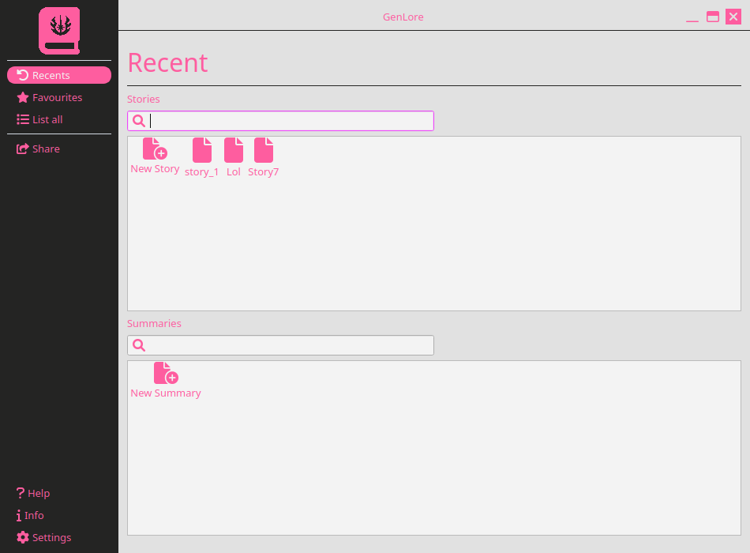
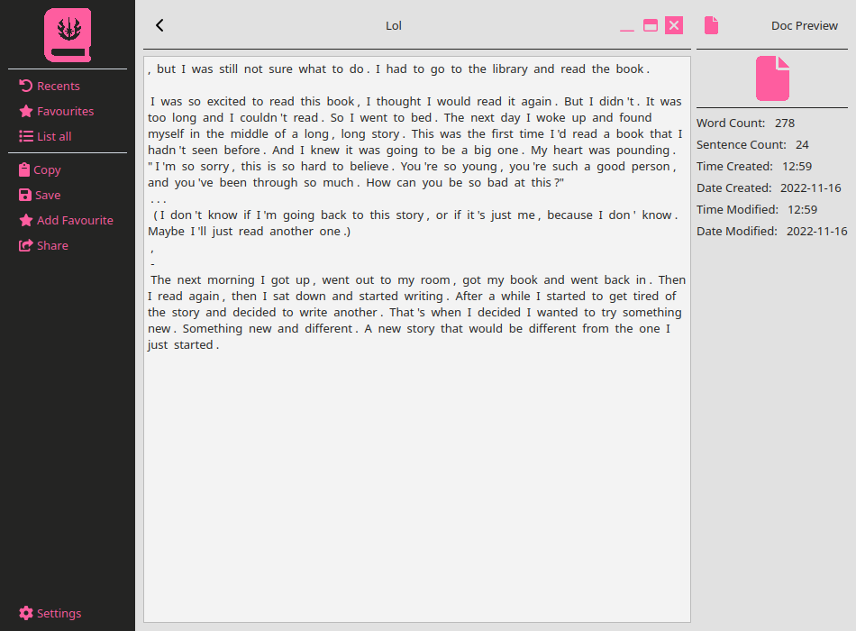

# Generation Lore

- This project utilizes GPT-2 which has 128 million parameters to generate interesting stories and summaries for the user.
- It supports English Inputs only
- It can export or clipboard the generated story or temporarily store it for later reference.
- Ui has been made in PySide6 which is supported in Windows, Linux, Mac OS.

## Requirements

#### Minimum Requirements:

1. CPU: 4 core
2. RAM: 4GB
3. Storage: SSD

#### Recommanded Requirements:

1. CPU: 6 core
2. RAM: 8GB
3. Storage: SSD

# Installation

> ! The project supports Windows 11 in Win Family

> ! The project supports Linux with x11 display manager in Wayland the window is not movable

1. Install Python in your pc
2. Additionally if you are using Windows OS then also install GTK Runtime for Windows
3. Download the Project and "`pip install -r requirements.txt`"
4. Run the `intialize.py` file
5. Inside the project folder execute `pip install -e .`

---

### Screenshots

